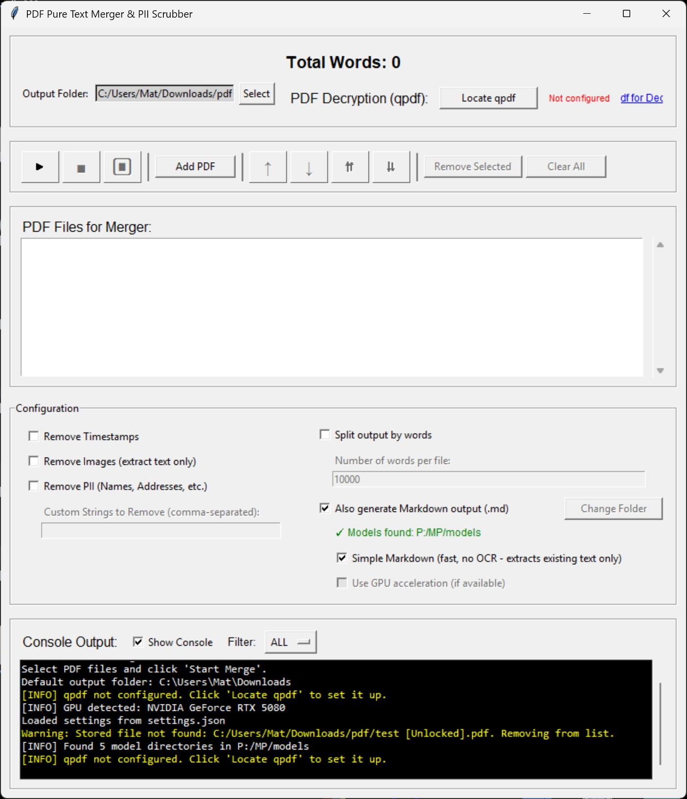

# pdf_merger_app

A desktop utility built with Python and Tkinter for merging multiple PDF files into one or more clean, text-focused documents. It is designed to process documents by removing non-essential data like images, timestamps, and sensitive personal information (PII) before merging.

---

## Key Features

-   **Merge PDFs**: Combine multiple PDF files in a specified order. Files can be easily added, removed, and reordered.
-   **PII Scrubbing**: Automatically finds and redacts potential PII like names, addresses, and account numbers using regular expressions. It also supports custom, user-defined strings for targeted redaction.
-   **Text-Only Extraction**: An option to remove all images from the documents, creating a final PDF containing only the extracted text.
-   **Timestamp Removal**: Cleans transcript-style timestamps (e.g., `[00:01:23.456 --> 00:01:25.789]`) from the text.
-   **Split by Word Count**: Automatically splits the final merged output into multiple smaller PDF files based on a user-specified word count limit.
-   **Persistent Settings**: Remembers your file list, output folder, and all configuration options between sessions by saving them to a `settings.json` file.
-   **Job Control**: The application UI remains responsive during processing. The merge operation runs in a background thread and can be paused, resumed, or stopped at any time.
-   **Live Console Output**: A console window provides real-time feedback and logging on the status of the merge process.



---

## Dependencies

-   Python 3.x
-   PyMuPDF: The core library used for all PDF manipulation.

---

## Installation & Usage

1.  **Install Dependencies**: Make sure you have Python 3.8+ installed. Then, install all required dependencies:
    ```sh
    pip install -r requirements.txt
    ```
    
    Or install individually:
    ```sh
    pip install PyMuPDF marker-pdf opencv-python torch transformers
    ```

2.  **Run the Application**: Execute the Python script from your terminal:
    ```sh
    python pdf_merger_app.py
    ```

**Note**: On first run with markdown conversion enabled, the app will download AI models (~1-2GB). Ensure you have:
- Internet connection
- Sufficient disk space
- Models directory configured in the app

---

## Building the Executable (Windows)

[cite_start]The repository includes a `build.bat` script to create a standalone Windows executable (`pm.exe`) using PyInstaller. [cite: 1]

1.  **Install PyInstaller**:
    ```sh
    pip install pyinstaller
    ```
2.  **Run the Build Script**:
    ```bat
    build.bat
    ```
3.  [cite_start]**Locate the Executable**: The final `.exe` file will be located in the `dist` folder. [cite: 2]

